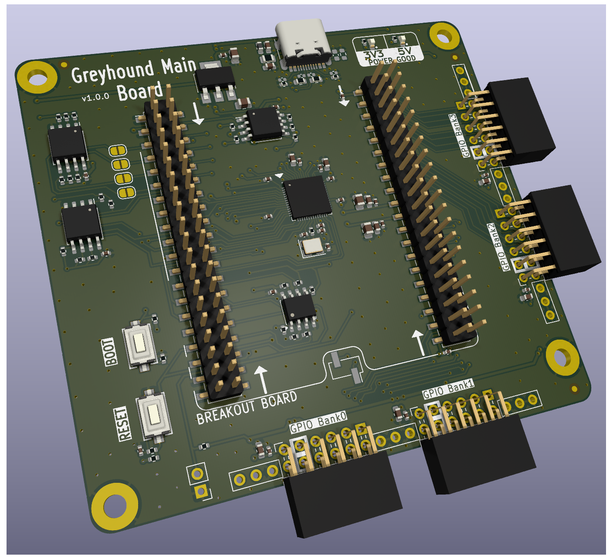

# Greyhound Main PCB

This repository holds the main PCB for [Greyhound](https://github.com/mole99/greyhound-ihp).
It is intended to be used together with a breakout board.

It is based on the [TinyTapeout Demo Board](https://github.com/TinyTapeout/tt-demo-pcb). Thanks a lot!

The PCB was designed with KiCad version 9.0.

Check out the project in your browser using KiCanvas: [Greyhound Breakout PCB](https://kicanvas.org/?github=https://github.com/mole99/greyhound-main-pcb/blob/main/greyhound-main-pcb.kicad_pro)

# License

The PCB is licensed under the Apache 2 License
